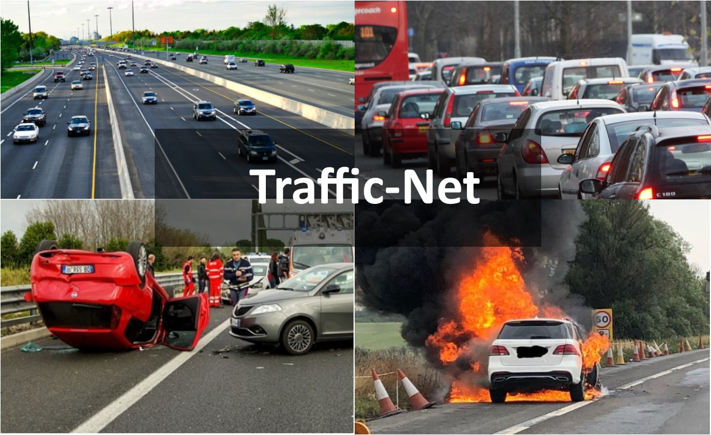
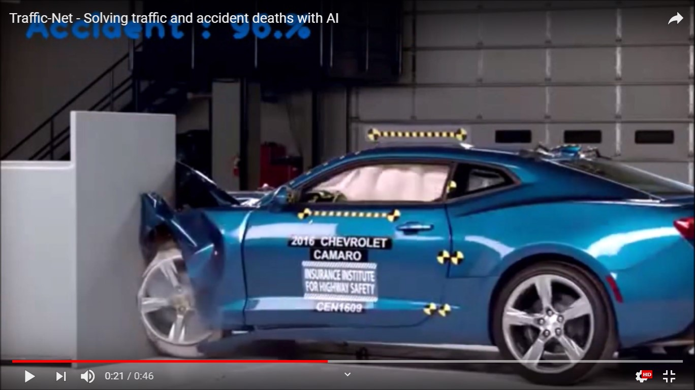
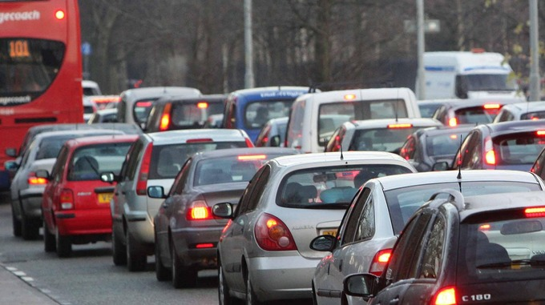
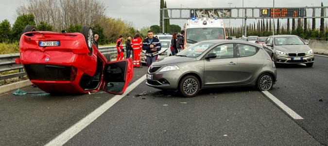
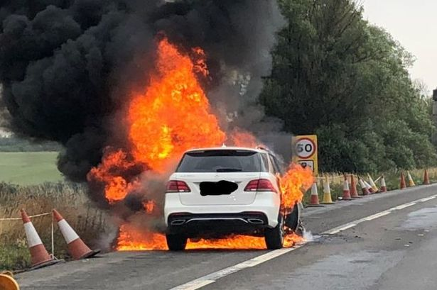

# Traffic-Net
Traffic-Net is a dataset containing images of dense traffic, sparse traffic, accidents and burning vehicles.
  

<b>Traffic-Net</b> is a dataset of traffic images, collected in order to ensure that machine learning systems can be trained
 to detect traffic conditions and provide real-time monitoring, analytics and alerts. This is part of <a href="https://deepquestai.com" >DeepQuest AI</a>'s to train machine learning systems to 
  perceive, understand and act accordingly in solving problems in any environment they are deployed.   

  This is the first release of the Traffic-Net dataset. It contains 4,400 images that span cover 4 classes. The classes
  included in this release are:   

  - <b> Accident </b>  
  - <b> Dense Traffic </b>  
  - <b> Fire </b>  
  - <b> Sparse Traffic </b>  

  There are <b>1,100 images</b> for each category, with <b>900 images for trainings </b> and <b>200 images for testing</b> . We are working on adding more
   categories in the future and will continue to improve the dataset.
        

  <b>>>> DOWNLOAD, TRAINING AND PREDICTION: </b>   
 The <b>Traffic-Net</b> dataset is provided for download in the <b>release</b> section of this repository.
 You can download the dataset via the link below.   <a href="https://github.com/OlafenwaMoses/Traffic-Net/releases/tag/1.0" >https://github.com/OlafenwaMoses/Traffic-Net/releases/tag/1.0</a>    

 We have also provided a python codebase to download the images, train <b>ResNet50</b> on the images
  and perform prediction using a pretrained model (also using <b>ResNet50</b>) provided in the release section of this repository.
  The python codebase is contained in the <b><a href="traffic_net.py" >traffic_net.py</a></b> file and the model class labels for prediction is also provided the 
  <b><a href="model_class.json" >model_class.json</a></b>. The pretrained <b>ResNet50</b> model is available for download via the link below.    
  <b><a href="https://github.com/OlafenwaMoses/Traffic-Net/releases/download/1.0/trafficnet_resnet_model_ex-055_acc-0.913750.h5" >https://github.com/OlafenwaMoses/Traffic-Net/releases/download/1.0/trafficnet_resnet_model_ex-055_acc-0.913750.h5</a></b> 
   
   This pre-trained model was trained for **60 epochs** only, but it achieved over **91%** accuracy on 800 test images. You can see the prediction results on new images that were not part of the dataset in the **Prediction Results** section below. More experiments will enhance the accuracy of the model.
 
Running the experiment or prediction requires that you have **Tensorflow**, and **Keras**, **OpenCV** and **ImageAI** installed. You can install this dependencies via the commands below.

 <b>- Tensorflow 1.4.0 (and later versions)  </b>      <a href="https://www.tensorflow.org/install/install_windows" style="text-decoration: none;" > Install</a> or install via pip <pre> pip3 install --upgrade tensorflow </pre> 
       
  <b>- OpenCV  </b>        <a href="https://pypi.python.org/pypi/opencv-python" style="text-decoration: none;" >Install</a> or install via pip <pre> pip3 install opencv-python </pre> 
       
   <b>- Keras 2.x  </b>     <a href="https://keras.io/#installation" style="text-decoration: none;" >Install</a> or install via pip <pre> pip3 install keras </pre> 
  
   <b>- ImageAI 2.0.3  </b>  
         <pre>pip3 install imageai </pre>     

<b>>>> Video & Prediction Results</b>   
Click below to watch the video demonstration of the trained model at work.  

    
  
<pre>
Sparse_Traffic  :  99.98759031295776
Accident  :  0.006892996316310018
Dense_Traffic  :  0.0031178133212961257
Fire  :  0.0023975149815669283
</pre>

 

<pre>
Dense_Traffic  :  100.0
Accident  :  9.411973422857045e-07
Fire  :  2.656607822615342e-07
Sparse_Traffic  :  4.631924704900925e-09
</pre>

 

<pre>
Accident  :  99.94832277297974
Sparse_Traffic  :  0.04670554480981082
Fire  :  0.004610423275153153
Dense_Traffic  :  0.00035401615150476573
</pre>

 

<pre>
Fire  :  100.0
Accident  :  1.9869084979303675e-22
Dense_Traffic  :  3.262699368229192e-23
Sparse_Traffic  :  6.003136426033551e-28
</pre>

 

<h3><b><u>References</u></b></h3>

 
 1. Kaiming H. et al, Deep Residual Learning for Image Recognition  
 <a href="https://arxiv.org/abs/1512.03385" >https://arxiv.org/abs/1512.03385</a>   
